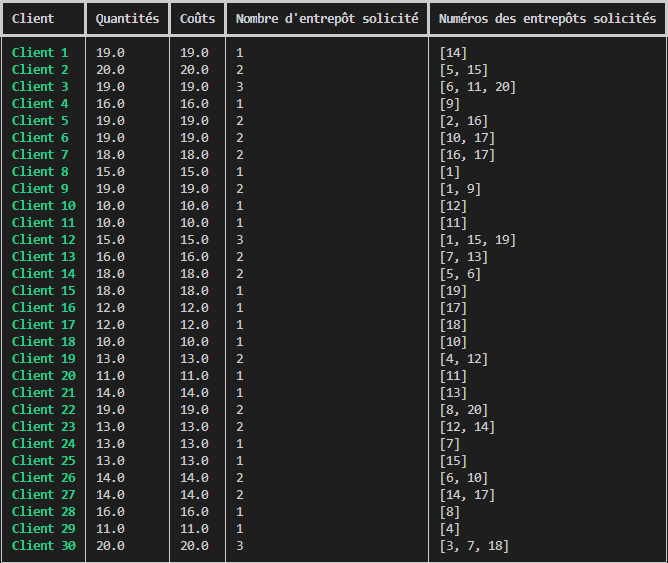
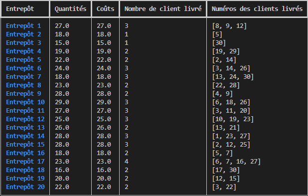
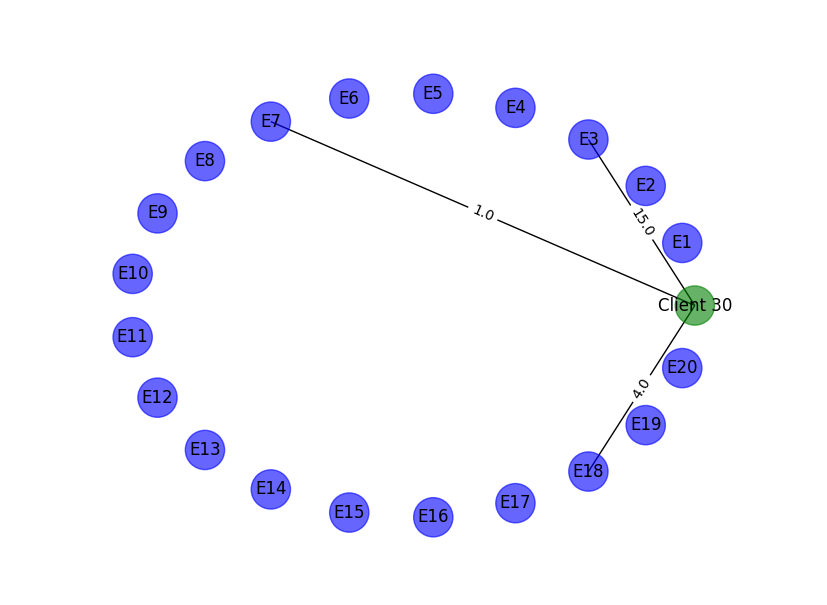
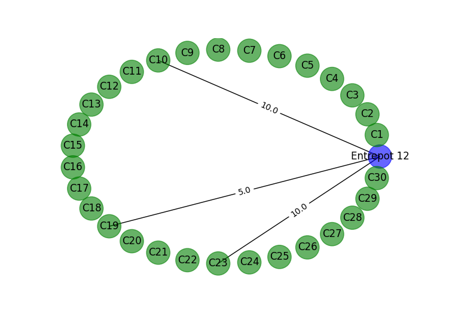

# Transporter

Le but de ce projet est de minimiser le coût de transport d'une entreprise disposant de plusieurs entrepots cherchant à deservir plusieurs clients.

## Méthode utilisé
Cette minimisation de coût sera effectué à l'aide de la fonction `linprog` du package [scipy](https://scipy.org/). 
En effet, pour ce problème on minimise le coût total de distribution de tous les clients en fonction des différentes contrainte de stock d'entrepots et des demandes des clients. 

Les contraintes sont les suivantes: 
- $\sum q_{ij} \le Q_i$ avec $Q_i$ la quantité total disponible dans l'entrepôt $i$. 
- $\sum q_{ij} = D_j$ avec $D_j$ la quantité total demandé par le client $j$.


## Installation / fichier requis
Tous les fichiers présent dans le repot GitHub.


## La base de données
La résolution du problème ne fonctionne qu'avec un type spécifique de base de données.

- Un base de données enregistré dans un fichier CSV.
- Les quantités disponibles et demandées doivent être renseignée en tonne: "`xT`".
- Les coûts doivent être de la forme : "`x$/T`".


<details>
  <summary>📷 Exemple de base de données </summary>
  <hr>

```
,19T,20T,19T,16T,19T,
27T,5$/T,3$/T,4$/T,5$/T,3$/T
18T,1$/T,4$/T,2$/T,1$/T,1$/T
22T,4$/T,3$/T,4$/T,3$/T,5$/T
25T,2$/T,3$/T,4$/T,3$/T,3$/T
22T,4$/T,1$/T,3$/T,4$/T,2$/T
```

 </details>


## Application avec Interface Utilisateur Textuel / dans le Terminal

A l'aide du package [Typer](https://typer.tiangolo.com/). 

- Pour voir l'aide. 
```python
python app.py --help
```

<details>
  <summary>📷  Les différentes sorties </summary>
  <hr>

  Différents tableaux en sortie [Rich](https://github.com/Textualize/rich)

```python
python app.py resultat-client --chemin /chemin/vers/base_de_donnees.csv
```


```python
python app.py resultat-entrepot --chemin /chemin/vers/base_de_donnees.csv
```


  
  Différente visualisation graphique à l'aide de graph [NetworkX](https://networkx.org/documentation/stable/index.html)

```python
python app.py representation-client --chemin ./transport.csv --client 30
```


```python
python app.py representation-entrepot --chemin ./transport.csv --entrepot 30
```



 </details>


## Application avec Interface Utilisateur Graphique. 

A l'aide du package [Textual](https://github.com/Textualize/textual).

```
textual run app_textual.py
```
Tout ce passe à la souris (ou presque !).

<details>
  <summary>🎬 Démonstration </summary>
  <hr>


https://user-images.githubusercontent.com/125368997/235438571-7049c92c-37ae-4eff-885d-174208d8a4fc.mp4

  
 </details>

## Compatibilité

Compatible avec Windows. 

Compatibilité avec Linux et MacOS à tester. 

Pour les packages voir fichier `pyproject.toml`. 
